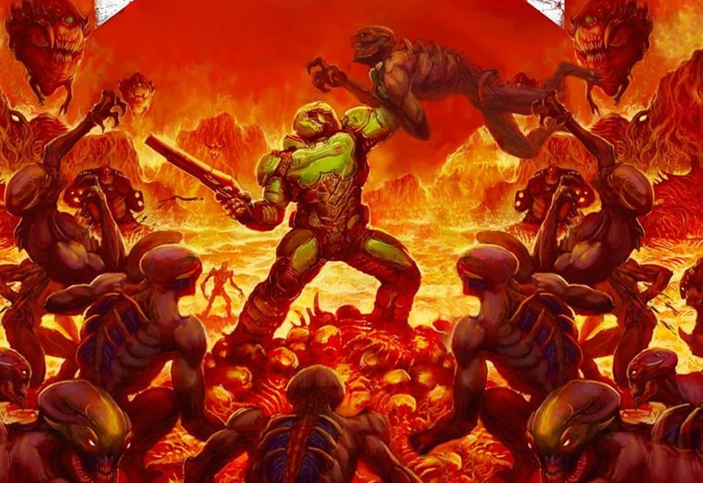

# 🐇 Slayer

The Slayer revels in combat. He is hard to kill, mobile and has an arsenal unlike any other. He is powerful from a range, but his enemies shudder in fear when he is even close due to his ability to swiftly finish any fights he started with glorious displays of power and gore. With a handful of supernatural abilities, firepower and superhuman strength, the Slayer is a force to be reckoned with.



<figure><figcaption>
Artwork from Doom 2016
</figcaption></figure>



| HP (brute) | 20(+12 per level) |
| ---------- | ----------------- |
| Poise      | 10                |
| Skills     | 2                 |
| Save       | Fort              |
| Memory     | 1+(1/2 lvl)       |



## <mark style="color:green;">1 - Technique Specialization (Martial)</mark>

You gain 0 technique points, not usable in any martial tree. You won't need them.\
Characters with martial specialization gain points in warfare equal to their highest tier of martial technique.

## <mark style="color:green;">1 - Energy (Su)</mark>

Fueled by fiendish rituals or blessed by celestial beings, you gain a pool of energy fueled by carnage. You have a maximum of 5 points of energy. You start each day with 5 points. If an ability costs energy, it is marked appropriately. If no cost is listed, assume it costs 1 point.

Energy can be restored in 2 ways.

* Defeat a creature of at least half your level (restores 1 point)
* Successfully glory kill a creature of at least half your level (restores 2 points)

## <mark style="color:green;">1 - Superhuman</mark>

* You add str instead of dex to for all weapons created by Energy (bigger str means bigger gun)
* +10 speed
* +4 bonus to athletics
* +2 attack, increasing to +4 against fiends.
* You can automatically jump as high and as far as you can move.
* You are immune to fall damage.

## <mark style="color:green;">1 - Feats</mark>

You gain the unarmed combatant and point blank master feats.

## <mark style="color:green;">1 - Glory Kill \[healing] \[overheal] \[elusive]</mark>

You can sense weakness in your enemies. Whenever a creature you can see is at or below an hp total equal to (9+lvl), you know. When a creature within 30 feet is at this threshold, you can spend an immediate action to dash with incredible speeds to reach it (in a straight line, even if it is airborne \[if you can't fly you fall]) and make an unarmed strike against it. On hit it instantly defeats the creature and you heal (3+lvl) hp.

If you so choose, though is completely unnecessary, you can brutally and spectacularly execute whatever creature you just targeted with this ability and they die...Horribly (fort negates). Killing a creature in such a way always results in some amazing feat of strength, agility and a disturbing creativity in the Slayer’s brutality.

If this threshold happens to be larger than the health pool possessed by the creature, the Slayer can still use this ability even though they have taken no damage, though he does not heal or regain Argent Energy off of them.

## <mark style="color:green;">1 - Energy: Old Friend</mark>

Using this energy, you can manifest a powerful double barrel shotgun with a creative attachment. Manifesting the gun is the same as the "swapping gear" action. Merely holding the gun does not require energy, but each shot requires 1 energy. The weapon stats are as follows…

<mark style="color:red;">DMG</mark> - 2d8 P\
<mark style="color:red;">Properties</mark> - 2h\
<mark style="color:red;">Range</mark> - 10 ft (no second increment)\
<mark style="color:red;">Experimental Rounds</mark> - Shots fire in a 10 ft line, functioning like a [blunderbuss](https://app.gitbook.com/s/s2e4XAiS8YASeBqQCRG7/equipment/weapon-rules/exotic-weapons#blunderbuss-2d6-pierce-2h-reload-10-lbs-800g).\
<mark style="color:red;">Meat Hook</mark> - You can fire a grappling hook at a surface or creature within 30 ft to drag yourself to it as a standard action. If you target a creature, you must make a ranged attack, but when you arrive adjacent to it, you can fire the shotgun or make an unarmed strike against the creature. Meat hook does not require energy.

## <mark style="color:green;">1 - Energy: Shredder</mark>

This ability functions as Old Friend, but instead of a shotgun you manifest an axe guitar with the following stats…\
<mark style="color:red;">DMG</mark> - 2d8 S\
<mark style="color:red;">Properties</mark> - 2h\
<mark style="color:red;">Shred</mark> - Gain proficiency in performance, but only in playing guitar. +4 when using the shredder.\
<mark style="color:red;">Riff of Rage</mark> - Give all allies within 60 ft +2 attack for 1 round (standard action)\
<mark style="color:red;">Special Attack: Finale</mark> - Declare an attack as a finale. If the attack ends the combat, future finale attacks gain +1 damage permanently. If it does not end the combat, lose 1 damage (minimum 0). A savvy foe can tell how many stacks you have.


Finale only stacks in actual combat, not training. You can never passively gain stacks.


## <mark style="color:green;">1 - Energy: Dash \[elusive]</mark>

As a free action, move 10 feet, even directly into the air. Can be used multiple times to cover great distances.

## <mark style="color:green;">2 - Energy: Blood Punch</mark>

Augment an unarmed strike that staggers the creature on hit (fort negates). If the attack is successful, enemies within 10 feet of the original target automatically take the attacks damage.

This ability can be used in tandem with techniques.

## <mark style="color:green;">3 - Energy: Heavy Assault</mark>

This ability functions as Old Friend, but instead of a shotgun you manifest a rifle with the following stats…\
<mark style="color:red;">DMG</mark> - 2d8 P\
<mark style="color:red;">Properties</mark> - 2h\
<mark style="color:red;">Range</mark> - 30 ft (no second increment)\
<mark style="color:red;">Zoom</mark> - As a FRA, make a single shot with 100 ft range and +2 attack.

## <mark style="color:green;">3 - Heavy Impact</mark>

When you fall at least 20 ft, you release a shockwave in a 10 ft radius around you. If you fell at least 50 ft, the shockwave is a 20 ft radius. The effect this has depends on the target and their HP threshold.

Against enemy minions, it sets them to your glory kill threshold. If they are already within the glory kill threshold, they are defeated.

Against anything else (including allies), it deals 10 poise damage.

## <mark style="color:green;">4 - Energy: Grenade</mark>

As a free action during movement, spend 2 energy to throw a supercharged ball of energy that explodes on impact on the ground, affecting all creatures within 10 ft of the space it lands in. You have 3 types of grenades\
<mark style="color:red;">\[Fire]</mark> - Set creatures ablaze (reflex negates).\
<mark style="color:red;">Frag</mark> - Deal (3d6+lvl) crush damage and poise damage. If this breaks poise, the creature is knocked down (reflex halves damage).\
<mark style="color:red;">\[Frost]</mark> - Put creatures in stasis for 1 round (reflex reduces to frosty for 1 round).

## <mark style="color:green;">5 - Energy: Hammer</mark>

This ability functions as Old Friend, but instead of a shotgun you manifest a hammer with the following stats…\
<mark style="color:red;">DMG</mark> - 2d8 C\
<mark style="color:red;">Properties</mark> - 2h, CM (Sunder)\
<mark style="color:red;">Horny Jail</mark> - As a standard action, automatically bonk a creature within reach to make them not horny for 1 hour.\
<mark style="color:red;">Hammer Down \[recharge]</mark> - 1/combat, strike the ground as a standard action to deal your (d6+d6/odd level) crush dmg and make creatures clumsy 2 within 20 ft (fort halves dmg).\
<mark style="color:red;">Plunging Attack</mark> - If you start your turn above a creature and are not flying/pseudo-flying, you can make a plunging attack. Plunging attack adds 1 damage per 10 feet you fall (max +20 dmg). Plunging attack can also apply to Hammer Down.

## <mark style="color:green;">6 - Striking</mark>

Weapon attacks gain additional damage equal to their damage dice. Gain this again at level 10\
Examples: \
2h weapon          @1=2d6, @6=4d6, @11=6d6\
Light Weapon    @1=d6, @6=2d6, @11=3d6

## <mark style="color:green;">7 - Energy: Ballista</mark>

This ability functions as Old Friend, but instead of a shotgun you manifest a hand held ballista with the following stats…\
<mark style="color:red;">DMG</mark> - 2d8 P\
<mark style="color:red;">Properties</mark> - 2h, Siege Weapon\
<mark style="color:red;">Range</mark> - 60 ft (no second increment)\
<mark style="color:red;">Special Attack: GET OVER HERE!</mark> - On hit make a drag attack with a +4 bonus. If successful they are pulled adjacent to you\
<mark style="color:red;">Siege Mode \[recharge]</mark> - 1/combat as a FRA charge and release a horizontal slashing energy projectile. Creatures in a 100ft line that is 15 ft wide take (5d8+lvl) slashing damage and start bleeding for 2d8 damage (reflex halves damage and negates bleed).\
You can reduce the charge time, making this only require a standard action, but the line is only 5 ft wide.

## <mark style="color:green;">9 - Energy: Sword</mark>

This ability functions as Old Friend, but instead of a shotgun you manifest a sword with the following stats…\
<mark style="color:red;">DMG</mark> - 2d8 S\
<mark style="color:red;">Properties</mark> - 2h, Special Attack: Determination\
<mark style="color:red;">Melt</mark> - As a standard action, cut a hole in a surface of solid or lesser toughness large enough for you to fit through with ease.\
<mark style="color:red;">Special Attack: Sever</mark> - On hit sever an limb from a creature (fort negates).\
Arm  - Creature is unable to use arm\
Leg   - Creatures speed is reduced by 15. Clumsy 1 permanently.\
Wing - Creature is unable to fly.

Other limbs can be selected, disabling natural attacks like tentacles and such. These are just the most common examples.

## <mark style="color:green;">10 - Carnage</mark>

You gain combat reflexes as a bonus feat.

You can use glory kill an instant action by consuming an AoO (essentially 3 times round unless you can AoO more somehow).
