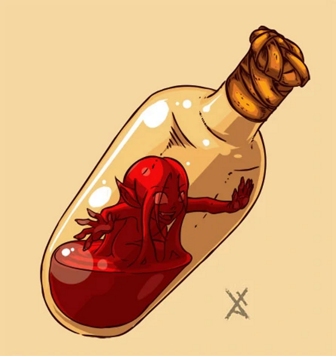

# Jizzle Physicks

A core part of a life of adventure is taking damage, and your friendly neighborhood alchemists have you covered. As part of your starting gear (or a fee of 50g if you lose yours) you gain access to a flask of wondrous physick with a regenerating ooze creature inside of it called a jizzle. When called upon, your jizzle will do its best to repair your body.

Functions as follows...

<table data-header-hidden><thead><tr><th width="101"></th><th></th></tr></thead><tbody><tr><td>Action</td><td>Standard to drink yourself or administer to another creature.</td></tr><tr><td>Effect</td><td>Heal to max hp after 3 turns. Stuns for 3 rounds as it snaps your bones back into place and clogs your veins before returning to its container. If you take damage or are poise broken during these rounds, you vomit it out immediately, providing no benefits.</td></tr><tr><td>Quirks</td><td>Jizzle physicks are personalized to an extent. It requires a creatures blood, and a 1 hour alchemical procedure (DC 11) for a jizzle physick to acclimate to a new user, otherwise it does not heal.</td></tr></tbody></table>

<figure><figcaption>
<a href="https://www.deviantart.com/xatchett/art/Autumn-Army-Polong-118695829">Autumn Army - Polong</a>
</figcaption></figure>
