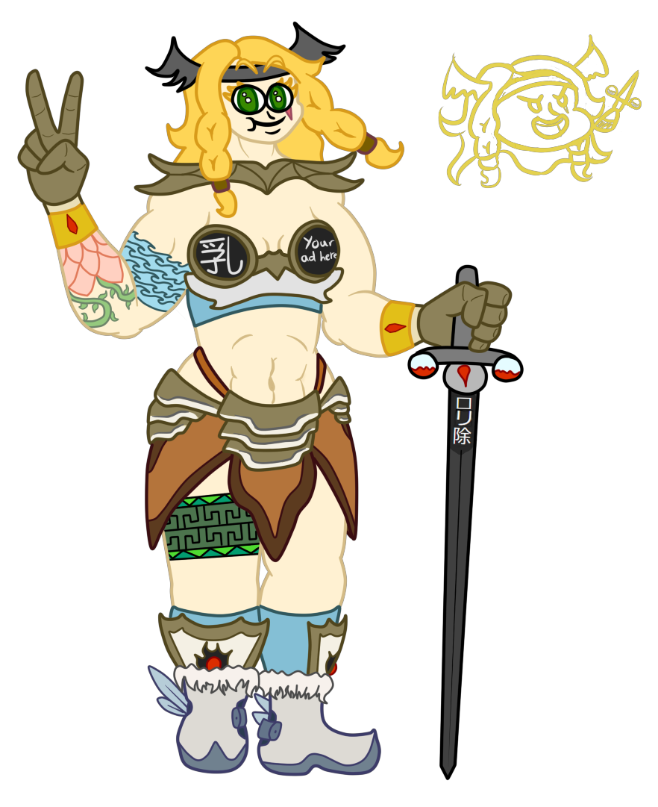

# 🏋️‍♀️ Amazon

Snu snu race.



Art by me!

<figure><figcaption></figcaption></figure>



<table data-header-hidden><thead><tr><th width="127"></th><th></th></tr></thead><tbody><tr><td>Language</td><td>Giant</td></tr><tr><td>Size</td><td>Medium</td></tr><tr><td>Type</td><td>Humanoid, Giant Choose another type from father. You count as their race for all purposes.</td></tr></tbody></table>



## <mark style="color:green;">Major Features</mark>

<table data-header-hidden><thead><tr><th width="126"></th><th></th></tr></thead><tbody><tr><td>Fitness</td><td>+10 base speed</td></tr><tr><td>Embiggen</td><td>As a swift action you can increase to large size. As a swift action decrease back to medium.</td></tr></tbody></table>

## <mark style="color:green;">Minor Features</mark>

<table data-header-hidden><thead><tr><th width="160"></th><th></th></tr></thead><tbody><tr><td>Well Adapted</td><td>You do not suffer any negative effects from existing in one specific type of environment, such as volcanic, arctic or other such extremes. This doesn’t apply to things like toxic volcanic gas, but more things like elevation, water pressure and temperature.</td></tr><tr><td>Warriors Call</td><td>At will increase the volume of your voice to three times it's normal volume.</td></tr></tbody></table>

## <mark style="color:green;">Replace Features</mark>

<table data-header-hidden><thead><tr><th width="189"></th><th></th></tr></thead><tbody><tr><td><strong>Major</strong></td><td> </td></tr><tr><td>Battle Grace</td><td>Gain DR2 vs poise damage.</td></tr><tr><td>Survival Instinct</td><td>Automatically negate the first effect that would defeat you each day.</td></tr><tr><td>Power Through</td><td>Gain 3 temp hp when out of combat for 1 minute. Get +1 to saving throws while you have temp hp. On hit effects (like a poisonous bite) happen after taking damage and thus the saves bonus doesn't apply.</td></tr></tbody></table>

***

<table data-header-hidden><thead><tr><th width="187"></th><th></th></tr></thead><tbody><tr><td><strong>Minor</strong></td><td> </td></tr><tr><td>Rugged Appeal</td><td>+2 bonus to persuasion</td></tr><tr><td>Animal Guardian</td><td>Your beast companion gets 5 bonus hp.</td></tr><tr><td>Lift</td><td>+100 carry weight</td></tr><tr><td>Mixed Blood</td><td>Choose the minor feature of another race (including alternate features). You count as both races for all purposes. Must match type .</td></tr></tbody></table>

***

## <mark style="color:green;">Lore</mark>

<table data-header-hidden data-full-width="true"><thead><tr><th width="144"></th><th></th></tr></thead><tbody><tr><td>Numbers</td><td>Amazon tend to be around 6'6 and weigh around 250 lbs Amazon are adults by 15, tend to maintain their youth until their 60s, then experience the usual physical decline, tending to live until about 100</td></tr><tr><td>Appearance and Biology</td><td>Amazon typically appear similar to other humanoids, but with a much larger build. They are tall mesomorphs that tend to have a lot of variety, even within the same family. Amazon exclusively birth other amazon and are always female. Because of their inability to interbreed with each other, they must seek other races to maintain their population. This results in a larger degree of variety than most other races, inheriting varying skin colors, tusks, horns etc. Amazon typically wear armor, but the armors tend to be more "tribal" in appearance. That is to say they use materials on hand like animal pelts or bone. Amazon typically grow attached to specific trinkets they collect during their adventures: Special hats, jewelry etc. It is incredibly common for Amazon to have elaborate body and face tattoos, typically being more pattern focused than being of specific objects or creatures, and always avoiding the eyes. Amazon particularly desperate for male attention will wear what their sisters call "horny armor" which practically provides little protection and only serves to draw the gaze of potential mates.</td></tr><tr><td>Scenic Nowhere</td><td>
Amazon typically only live in smallish communities of only a few hundred in the far off reaches of the world, where they typically aren't bothered: Icey peaks, deep jungles and volcanic wastes. This makes actually finding their home very difficult for an outsider, but an Amazon always has a 6th sense for how she might return home. Amazon often have unique adaptations that allow them to exist sustainably in such harsh environments. Sometimes this comes in the form of hunting or farming techniques, others it means biological adaptation to extremes in temperature.

Amazon are typically wary of outsiders when close to home. Each tribe have a different policy depending on their history, but typically outsiders are judged by those most knowledgeable, the elders or by their chieftess. The chieftess is usually the most powerful and influential member of a particular tribe and is treated with great respect. A slight against the chieftess is a slight against the family as a whole, and is a quick way to get kicked out, or worse depending on the practices of that tribe.
</td></tr><tr><td>Family</td><td>
Amazon have a particularly close bond with their family. They all share the same last name and rarely choose to change it, seeing their heritage as something to take pride in. They greatly emphasize the "it takes a village to raise a child" philosophy and every child is everyone's responsibility. As such the role of childbearing is seen less of a personal responsibility and more of a commitment to the continuation of the family. The role of mom specifically is also deemphasized, but what mother wouldn't show a bit of preferential treatment to one of their own. Amazon can typically expect their sisters, and especially their elders, to pick up on any slack with regards to child rearing as a result of being stretched thin by responsibilities. Amazon typically return back home if they experience great hardship, grow old or find a partner/get pregnant.

To an Amazon, there is no greater threat than one that threatens their tribe. They will take up arms against anything if it threatens their way of life, and may be willing to resort to anything in order to protect their kin.
</td></tr><tr><td>Adventures and Duels</td><td>
Nearly every young Amazon is expected to leave home at some point, usually in pairs with a sister of similar age. There is always the underlying goal of hoping to find love, but rarely is that the priority. They go out to perform specific tasks, carry on where their older sisters left of, or to simply make a name for themselves. As such they often find themselves living off the land and doing small jobs where they learn what was fact and what was fiction from all the stories they heard from their sisters growing up: The "civilized" world can often be just as cruel as the harsh biome they hail from, but in entirely new and frustrating ways. Things like land ownership and bumping heads on tiny doorways are oft-sited frustrations with most civilization.

Regardless of style, all Amazon are combat-trained. As such, scrappy folks looking to test their mettle will challenge amazon to battles. Amazon will usually accept duels with females if they're in the mood, but will only duel males they are interested in or attracted to. If the amazon is victorious, they usually lose interest.
</td></tr><tr><td>Banishment</td><td>It does not happen often, but when an amazon betrays her family or does something the tribe sees as particularly heinous, they are banished: A specific type of mask-like tattoo is placed over their eyes that is always visible, even through magical transformations. Only through physically covering the face can the tattoo be hidden. The banished is stripped of their family name and forbidden from returning back home. Being banished from one tribe guarantees a life of hardship, as the tattoo is a universal sign to all amazon, making the banished unable to ever establish the bond of kinship again. Amazon instinctually detect and distrust any creature that bears the mark of the banished.</td></tr></tbody></table>
