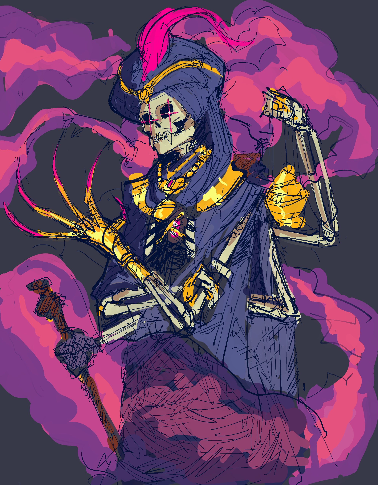

# Boner

The bone zone race.



<figure><figcaption></figcaption></figure>

<figure><figcaption>
Helltaker's skeletal enemy...with some slight alterations
</figcaption></figure>



<table data-header-hidden><thead><tr><th width="128"></th><th></th></tr></thead><tbody><tr><td>Language</td><td>Necril</td></tr><tr><td>Size</td><td>Medium or small</td></tr><tr><td>Type</td><td>While boners are undead, they cannot be targeted by effects that control undead creatures. For all other purposes they count as humanoid and undead</td></tr><tr><td>Vitality [recharge]</td><td>
Once per minute as a swift action, boners can produce a cloud of blue mist (doesn't obscure vision) in a 10 ft radius around them to hamper non-Boner undead around them. Such creatures are staggered for as long as they remain in the mist, and 1 round thereafter.

Through prolonged exposure to this mist, an undead creature becomes a boner (provided it has a skeleton). If it doesn’t, it is instead destroyed in such a way to free its soul from necromantic control.
</td></tr></tbody></table>



## <mark style="color:green;">Major Features</mark>

<table data-header-hidden><thead><tr><th width="134"></th><th></th></tr></thead><tbody><tr><td>Resistance</td><td>Gain resistance to necrotic damage.</td></tr></tbody></table>

## <mark style="color:green;">Minor Features</mark>

<table data-header-hidden><thead><tr><th width="100"></th><th></th></tr></thead><tbody><tr><td>Trance</td><td>+4 bonus to sleep effects. Instead of sleeping to rest, you enter a meditative state where you remain aware of your surroundings.</td></tr><tr><td>Night Vision</td><td>You treat dim light as bright light. You treat darkness as dim light.</td></tr></tbody></table>

## <mark style="color:green;">Replace Features</mark>

<table data-header-hidden><thead><tr><th width="101"></th><th></th></tr></thead><tbody><tr><td><strong>Major</strong></td><td> </td></tr><tr><td>Play Dead</td><td>Boners can collapse into a pile of bones on the ground and make all their equipment disappear as a standard action.  This allows them to hide in plain sight and use disguise in place of stealth (if desired) with a +2 bonus.  Exiting this ability is a free action. If the setting would be too unusual for a skeleton to be in (middle of a crowded street) or people see you activate this ability, then it doesn’t work.</td></tr><tr><td>Lend a Hand</td><td>
Boners can remove their arms and use them even while detached, albeit in a limited fashion. As a free action they can detach an arm

They can use this ability to increase the reach of an attack only requiring one hand by 5-feet by wielding their sword arm in their other hand. Disarmed limbs move at a rate of 5 feet per round back to their owner and reattach when they enter your space.
</td></tr></tbody></table>

***

<table data-header-hidden><thead><tr><th width="151"></th><th></th></tr></thead><tbody><tr><td><strong>Minor</strong></td><td> </td></tr><tr><td>Big Boned</td><td>+100 carrying capacity.</td></tr><tr><td>Ghost Wrangler</td><td>You treat incorporeal creatures as though they were a corporeal for things like combat maneuvers, attacks, spells etc.</td></tr><tr><td>Favored Enemy</td><td>+2 religion</td></tr></tbody></table>

***

## <mark style="color:green;">Lore</mark>

<table data-header-hidden data-full-width="true"><thead><tr><th width="147"></th><th></th></tr></thead><tbody><tr><td>Numbers</td><td>Varies based on humanoid bone'd. They weigh about 15% of their original body weight. Boners live to be about 50 before the animating force leaves their bones for good</td></tr><tr><td>Appearance</td><td>
Boners are the skeletons of humanoid creatures and vary a bit in shape and size based on their original race. Since their bodies are without skin and only bones, they are often mistaken for the nefarious creations of necromancers, but boners try to mitigate that with an extreme sense of style. They wear fancy outfits, outrageous hats and use their boney bodies as a canvas for artistic expression. It isn’t uncommon to see a Boner embed gems into their body, give themselves extensive tattoos or apply trails of melted gold in their cracked bones.

A particularly unusual feature they possess is the ability to bend parts of their skulls.  This allows them to make facial expressions (imagine Grim Adventures of Billy and Mandy). Most possess glowing lights in their sockets to replace their eyes.
</td></tr><tr><td>Vitality</td><td>Boners are the cure for undeath. They possess the ability to free the soul of the undead creature, granting it control over what's left of its body. Not only are they able, but they are obsessed with the idea of curing undead. You'd be hard pressed to find creatures with a greater distaste for undead. Most make it their mission to free what they see as imprisoned brothers and sisters. Vitality only works when exposed to the gas over a prolonged period of time, requiring undead to be captured instead of killed. Usually the process takes about 10 minutes for most undead, but particularly powerful ones can take hours or even days. Even undead that were quite fond of their previous forms have a drastic change in their mindset and are immediately disgusted by what they had become.</td></tr><tr><td>'Til Death Do Us Part</td><td>Boners typically remember very little, if anything, from their previous life, usually writing it off as déjà vu. Some of their personality remains intact and they have the same general shape, but most of their previous selves was erased when they washed ashore in the underworld through the river Styx. They do remember everything they experienced while an undead monster. The quest to cure the world of necromancy is an impossible one, but it is one the boners accept with gusto, as it means they get to increase the size of their family. Boners develop a closeness with their with their captures. They always develop a very close bond with the first creature that cure, unless that creature already had a partner. Lacking biology, they don’t care much for physical intimacy and pay little attention to gender or even species. Subsequent cures while a boner already has a partner are treated more like children. These comparisons are imprecise, considering most boners are of adult creatures and it can be difficult for most to imagine an intimate relationship without a physical component, but it serves as an easy way to explain to the meatbags.</td></tr></tbody></table>
