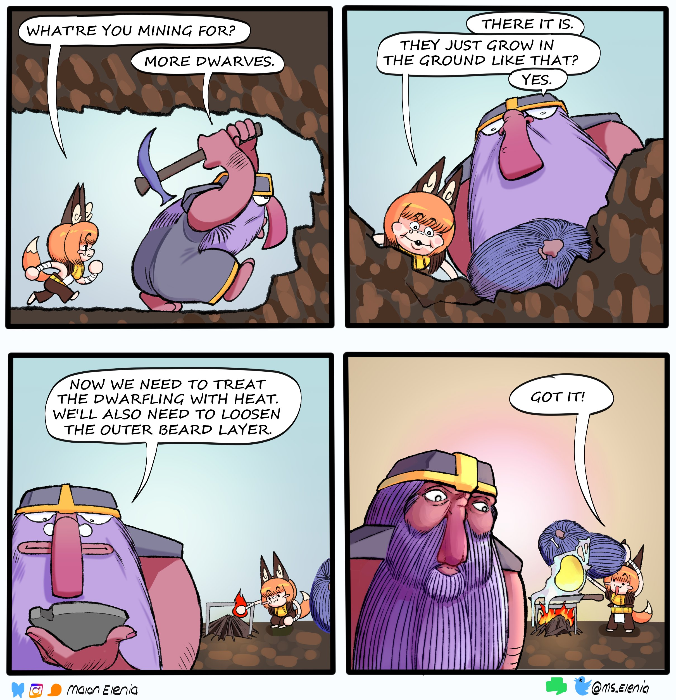

# Dwarf

The short and stocky beard dude race



<figure><figcaption>
By <a href="https://x.com/Ms_Elenia">Malon</a>
</figcaption></figure>

<figure><figcaption>
By me!
</figcaption></figure>



| Language | Dwarven  |
| -------- | -------- |
| Size     | Medium   |
| Type     | Humanoid |



## <mark style="color:green;">Major Features</mark>

<table data-header-hidden><thead><tr><th width="127"></th><th></th></tr></thead><tbody><tr><td>Hardy</td><td>Gain resistance to poison</td></tr><tr><td>Slow and Steady</td><td>Increase your poise by 5 and hp by 10</td></tr></tbody></table>

## <mark style="color:green;">Minor Features</mark>

<table data-header-hidden><thead><tr><th width="143"></th><th></th></tr></thead><tbody><tr><td>Night Vision</td><td>You treat dim light as bright light.  You treat darkness as dim light.</td></tr><tr><td>Beard of Holding</td><td>You can store 1 item that you can hold in a single hand that weighs no more than 10 lbs inside of your beard.</td></tr></tbody></table>

## <mark style="color:green;">Replace Features</mark>

<table data-header-hidden><thead><tr><th width="125"></th><th></th></tr></thead><tbody><tr><td><strong>Major</strong></td><td> </td></tr><tr><td>Racism</td><td>Choose a race of humanoids. You gain +1 priority when you enter combat with them as one of your enemies. You're automatically taunted by them for 1 round.</td></tr><tr><td>Salt Beard</td><td>As a swift action, coat a held weapon in your beard salt. Your next attack with it inflicts taunt for one round (fort negates).  You must quaff food for at least one minute to recharge this ability.</td></tr><tr><td>Flame Belch</td><td>As a standard action, you can light and raise a flame to your mouth, then belch on an adjacent creature. They are set ablaze (reflex negates). It takes another standard action of drinking an alcoholic beverage to recharge this ability.</td></tr><tr><td>Stubborn</td><td>Whenever an effect would move you against your will, reduce the distance moved to 5ft as an immediate action. If you don't spend an action, reduce the distance of all forced movement by 5ft.</td></tr></tbody></table>

***

<table data-header-hidden><thead><tr><th width="161"></th><th></th></tr></thead><tbody><tr><td><strong>Minor</strong></td><td></td></tr><tr><td>Not Impressed</td><td>+2 bonus to saves against charm effects</td></tr><tr><td>X to Doubt</td><td>+2 bonus to insight</td></tr><tr><td>Mountaineer</td><td>You use your full speed to climb and ignore rocky difficult terrain, such as rubble, stairs etc.</td></tr><tr><td>Value Scent</td><td>You possess blindsense (scent, 5ft). It is only usable on detecting the value of objects.  You are automatically are able to discern the value of something with a quick sniff. Particularly valuable things such as rare magic items may have extremely powerful and wide scents as strongly scented creatures and objects normally would.</td></tr><tr><td>Book of Grudges</td><td>You meticulously record all events that you perceive as negative in a government approved book. Slights against your character, betrayals, enemies, lies and the like are all written down in the book.  By presenting this book in a suitable situation, such as incriminating someone, you get a +2 bonus to skill checks.</td></tr></tbody></table>

***

## <mark style="color:green;">Lore</mark>

<table data-header-hidden data-full-width="true"><thead><tr><th width="142"></th><th></th></tr></thead><tbody><tr><td>Numbers</td><td>Dwarves tend to be around 4' tall and weigh 150 lbs Dwarves reach adulthood by 20 live to be around 150</td></tr><tr><td>Appearance and Biology</td><td>Dwarves are universally male. Rather than reproducing through traditional means, they go mining to find more dwarves. Dwarves are a naturally occurring resource just like iron, and can be harvested as such. They usually appear inside of stone-y egg-like structures with the texture of hair. These eggs naturally form as a result of "dwarf energy" which is created through the act of mining. Dwarfling eggs can only form in unworked stone, making it necessary to go far out from home to find them. More dwarf energy is generated when dwarves mine, and dwarves have a more keen sense when it comes to finding dwarfling eggs, making it uncommon for other humanoids to discover them. There are a handful of ways to hatch a dwarfling egg. Some use specific solvents like a shampoo to soften the protective outer beard shell while others warm it up and comb at it when it softens. When hatched, dwarflings start off a bit more developed then birthed humanoids. With roughly a year head start, they can already move around on their own, eat most foods and understand basic physics. Dwarves are easily identifiable from their wide frames, short statures and incredible beards. They typically have a higher density of muscles and hair than most other humanoids. They take exceptional care of their facial hair, prioritizing it over the hair on the top of their head. Dwarves hatch with beards, so it is very rare to see one without a beard. Average dwarves tend to be wary of beardless dwarves.</td></tr><tr><td>Vibe Check</td><td>Because dwarves have completely different biology when it comes to reproducing, their family structure doesn't follow that of creatures that give birth to their own young. Instead, dwarflings stick with whoever mined them during their early years. By the time they are teenagers, they can get a feel for their immediate family and decide whether or not they are a good fit for them. As such, dwarves form families (called Brotherhoods) similar to how most people find friend groups. Dwarves who don’t click with the family they were hatched into will readily leave to go find people that share ideals/lifestyle more closely. Dwarves that are part of a brotherhood share the same name, but are willing to drop it when they change or they think the brotherhood 'aint what it used to be. Dwarves who don't vibe with the local brotherhoods have a tendency to wander around the overworld until they find a nice craftsman or adventuring party to latch onto. Dwarves innately have a strong ability to read people, making this somewhat naïve approach to finding family more viable. Just because a dwarf is traveling doesn't automatically mean they aren't part of a brotherhood. Sometimes it is necessary to do business with surface dwellers.</td></tr><tr><td>Round Up The Lads</td><td>
Because dwarves do not have genders, they are a lot less sensitive to the kinds of dynamics having sexual dimorphism causes in humanoids. It can take a bit of getting used to not bathing or taking a leak in the presence of ladies. Dwarves tend to treat women of other races just like the men. This comes with a whole host of problems, but it also comes with a few positives. A woman having a dwarf friend is a bit like having a woman having a gay guy friend, where they can feel at ease knowing that the dwarf isn't looking for every opportunity to get into her pants.

Dwarves tend to express masculine ideals much more frequently. They enjoy one upping each other when it comes to tests of strength and especially endurance. A favorite is the drinking contest, which most dwarves will handily win. Unfortunately for suitors, they are also aromantic, making such advances made against them fly right over their head.
</td></tr><tr><td>Secrets of the Dwarves</td><td>Larger brotherhoods or groups willing to cooperate can sometimes get up to some…Interesting shenanigans when it comes to the experimentation on dwarflings. Nearly everything related to the topic is a closely guarded secret, known only by a handful of elders in the brotherhood. Rumor has it though that the dwarves will use some arcane mining methods in order to increase the chances of dwarflings appearing inside of rare metals like gold. These oddities are usually substantially different from the standard dwarf, taking on some of the properties of the metal they form from. Golden dwarves, a favorite amongst the dwarven elite, tend to be softer, thinner and more magically talented. There are even some rumors of dwarfling eggs being used as part of the forging process in order to create metallic dwarves. If such things do exist and are not just fantasy stories told by bards looking to capture the interest of the common folk, then they have never seen the light of day.</td></tr></tbody></table>
