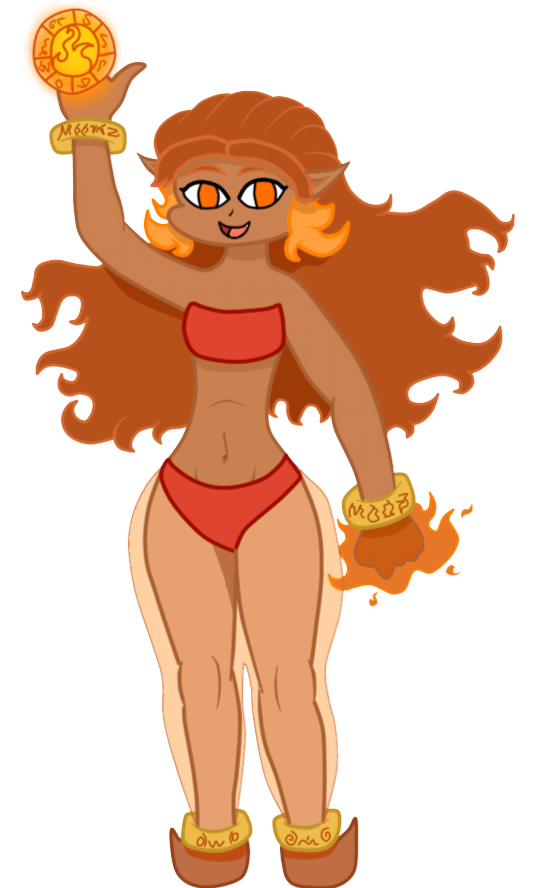

# 🧞‍♂️ Geniekin



<figure><figcaption>
Art by me!
</figcaption></figure>

<figure><figcaption>
Art by me!
</figcaption></figure>

<figure><figcaption>
Art by me!
</figcaption></figure>



| Language | Primordial                                                                                                                      |
| -------- | ------------------------------------------------------------------------------------------------------------------------------- |
| Size     | Medium or small                                                                                                                 |
| Type     | Humanoid, Elemental                                                                                                             |
| Element  | Choose one of the four elements: earth, wind, fire, water. Your racial features are augmented based on what element you choose. |



## <mark style="color:green;">Major Features</mark>

<table data-header-hidden><thead><tr><th width="133"></th><th></th></tr></thead><tbody><tr><td>Movement</td><td>
[Air] Hover equal to land speed. [Water] Swim equal to land speed and amphibious quality

[Earth] Burrow 5

[Fire] +10 speed
</td></tr><tr><td>Wish</td><td>1/day you can speak the words "I wish…" followed by a desire you have. Your next related task within an hour that requires a d20 roll you add 4 to it.</td></tr></tbody></table>

## <mark style="color:green;">Minor Features</mark>

<table data-header-hidden><thead><tr><th width="126"></th><th></th></tr></thead><tbody><tr><td>Mixed Blood</td><td>Gain a minor feature of another race (including alternate features). You count as both races for all purposes.</td></tr><tr><td>
Charged

[recharge]
</td><td>
As a swift action, charge your weapon/unarmed/natural attacks with energy for 1 round. They deal an extra d6 of damage.

[Air] Zap [Water] Cold

[Earth] Poison

[Fire] Fire
</td></tr></tbody></table>

## <mark style="color:green;">Replace Features</mark>

<table data-header-hidden><thead><tr><th width="218"></th><th></th></tr></thead><tbody><tr><td><strong>Major</strong></td><td></td></tr><tr><td>Bending Basics</td><td>You get the <a href="https://app.gitbook.com/s/vxnMGGHnEtmcEQDFxcK6/multiclass/bending-initiate">bending initiate</a> feat. Its damage shares your elemental tag</td></tr><tr><td>Resistance</td><td>
[Air] Zap [Water] Cold

[Earth] Poison

[Fire] Fire
</td></tr><tr><td>Diamond Skin [earth]</td><td>Ranged attacks cannot graze you</td></tr><tr><td>Kindling [fire]</td><td>You get +2 attack against creatures set ablaze. When you set a creature ablaze, the DC to get rid of it is 2 higher.</td></tr><tr><td>Water Blending [water]</td><td>While mostly submerged in liquid, you can hide in plain sight.</td></tr><tr><td>Storm Sight [air]</td><td>
You can see the silhouettes of creatures shrouded in clouds of gas.

Mist, fog, clouds etc cannot grant creatures total concealment to you, regardless of distance. Ignore partial concealment of adjacent creatures in such environments.
</td></tr><tr><td>Gem Bod [earth]</td><td>
When you are slain, you shatter into pieces. As long as most of these pieces are intact, they can be reattached, restoring them to life. This requires 500g worth of adhesive and 10 minutes of work. This process can also be done to restore a severed limb, requiring only 50g.

 Your memories are stored all throughout your body. When you sustain major damage, you lose some of your memories. Whenever you are defeated, you forget the minute leading up to when you were KO’d. When you are slain, or if you lose a limb, you forget the previous 24 hours. Losing more significant chunks permanently can give amnesia.
</td></tr><tr><td>Forged in Flame [earth or fire]</td><td></td></tr></tbody></table>

***

<table data-header-hidden><thead><tr><th width="200"></th><th></th></tr></thead><tbody><tr><td><strong>Minor</strong></td><td></td></tr><tr><td>Metalhead (Su)[earth] [recharge]</td><td>
As a standard action, you can cause the metal in your body to converge in your hands in a specific shape. You can use this to create weapons, tools, shields and other types of metal equipment. This should generally be something that is lightweight, like a hammer or a dagger.

You cannot use this feature until you absorb the metal object, or consume some more, and no more than 1/day.
</td></tr><tr><td>Deep dweller [earth or water]</td><td>Gain nightvision. You treat dim light as bright light.  You treat darkness as dim light.</td></tr><tr><td>Fired Up [fire]</td><td>+10 speed on the first round of combat. You can choose to emit bright light in a 20 ft radius. You can turn this off or on as a free action 1/turn.</td></tr><tr><td>Firefighter [fire or water]</td><td>By touching a fire, you can put it out and all fire within 10 ft. For magic effects, treat as dispel magic.</td></tr><tr><td>Close to Home [earth]</td><td>You do not take a penalty to AC while knocked down</td></tr><tr><td>Gust of Wind (Su) [air]</td><td>As easily as you can breathe, you can blow on an object within 30 ft to push it 30 ft in any direction. You can exert enough force to move dense objects less than 10 lbs short distances, but objects with large surface area like signs can be affected more easily.</td></tr></tbody></table>

***

## <mark style="color:green;">Lore</mark>

<table data-header-hidden data-full-width="true"><thead><tr><th width="139"></th><th></th></tr></thead><tbody><tr><td>Numbers</td><td>Geniekin stand around 5'6 and weigh around 150 lbs Earth and water geniekin tend to be slightly heavier, while air and fire tend to be lighter Geniekin are adults by 15 and live to be around 70 years old.</td></tr><tr><td>Appearance and Biology</td><td>
Geniekin are humanoids with roughly the same size and build as humans, but they come in 4 distinct variants based on their elemental affinity. Air geniekin tend towards light blue skin tones and white or blonde hair. They love feeling the wind blowing in their hair so they usually will go to great lengths to maintain a large head of hair. Air geniekin are the lightest of the bunch, rarely breaking 120 lbs for even the largest of them.

Fire geniekin have red and orange skin tones, and hair that resembles fire blazing atop their heads. Male geniekin will also have facial hair with the same properties. They have a much higher body temperature than most humanoids, making them very popular in the winter.

Water geniekin skin tones vary between blue and green, depending on whether they prefer salt or freshwater. Just like with firekin, their hair can also mimic their element. It looks as though it is in a constant state of flow. Most are amphibious, capable of living comfortably in land or sea. Earth geniekin are typically gray, brown, black or somewhere in between. Instead of hair, some grow crystalline structures on their head that they can mold to resemble hair. It lacks the same softness and malleability, but makes up for it with shinyness. Earthkin are the heaviest of the bunch. Their density causes them to be upwards of 200lbs. The "elemental-ness" of a geniekin can vary greatly. With some being closer to humans, and others that are made of stone for example.
</td></tr><tr><td>Like a Genie!</td><td>Geniekin are all the byproduct of genie wishes. One way or another, all of the humanoids generated through genie magic are geniekin. Wish for an army? Geniekin soldiers. Wish for a son? Geniekin. An entire planet complete with servants? Geniekin servants. Particularly large and grandiose wishes that people have made in the past have made it so the population of geniekin is steady beyond first generation wish creations. Created by magic, geniekin often feel drawn to studying magic in some way, shape or form. It makes them feel as though they are getting closer to finding the origin of their species. Many geniekin are still born with a spark of that genie's magic that created them all those years, perhaps even generations ago. All they need to do is speak "I wish" and their genie powers work to shape the reality to their liking…albeit in less impressive and more subtle ways. It's more like gently steering reality in a desired direction than shaping it.</td></tr><tr><td>Avatar</td><td>Geniekin are the creators of the 4 bending styles. They are often drawn to each other by their natural affinity for such magic. There are many settlements that started up as a result of several earth benders or water benders meeting up and starting a school to teach. The ability to bend their respective element is the primary uniting and binding force behind geniekin society. The most highly regarded individuals among geniekin are the bending masters. Benders will sometimes be given a final task by their masters to locate what they call "elemental wells." These are places that house large amounts of energy as a result of natural formations. Places like volcanoes or storms or tornadoes are common locations. These locations establish a much deeper connection between the bender and their element, and usually marks them as a master. Legend has it that when the world falls into chaos, there will be someone who is capable of mastering all 4 elements, drawing power from 4 different elemental wells, and using it to bring balance to the world.</td></tr></tbody></table>

