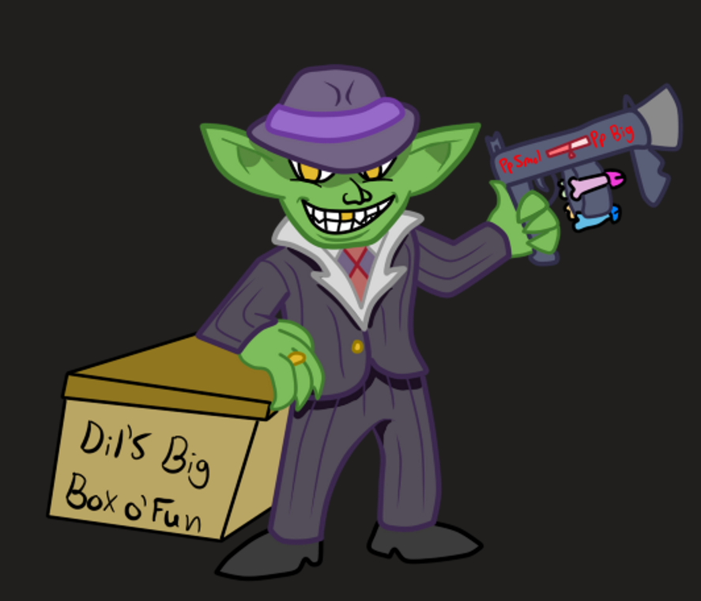

# 💚 Goblin

The green short stacks with big ears.



<figure><figcaption>
By me!
</figcaption></figure>

<figure><figcaption>
By me!
</figcaption></figure>

<figure><figcaption>
By Veroid Crom? It's what google says but twitter account is deleted
</figcaption></figure>



| Language | Goblin   |
| -------- | -------- |
| Size     | Small    |
| Type     | Humanoid |



## <mark style="color:green;">Major Features</mark>

<table data-header-hidden><thead><tr><th width="153"></th><th></th></tr></thead><tbody><tr><td>Underfoot</td><td>You can enter and leave a creature's space without provoking AoOs from it. You flank them as long as another ally threatens.</td></tr><tr><td>Strength in Numbers</td><td>When you flank, your bonus is +3 instead of +2. This also applies to your [companion] creatures.</td></tr></tbody></table>

## <mark style="color:green;">Minor Features</mark>

<table data-header-hidden><thead><tr><th width="144"></th><th></th></tr></thead><tbody><tr><td>Nice Ears</td><td>+2 bonus to perception</td></tr><tr><td>Night Vision</td><td>You treat dim light as bright light.  You treat darkness as dim light.</td></tr></tbody></table>

## <mark style="color:green;">Replace Features</mark>

<table data-header-hidden><thead><tr><th width="136"></th><th></th></tr></thead><tbody><tr><td>Major</td><td> </td></tr><tr><td>Roll With It [elusive]</td><td>When you take damage, you can choose to recoil as an immediate action. You move 10 feet in a direction of your choosing.</td></tr><tr><td>Boom Bots</td><td>Against any adjacent construct creature, you can attempt to make it go boom.  As a standard action roll an engineering check to deal that much force damage to it (fort halves).</td></tr><tr><td>Ankle Biter</td><td>You gain a bite attack that deals d6 base damage. When a creature rolls a combat maneuver check against you and fails to break your poise, you can make a simple bite attack against them as an AoO.</td></tr><tr><td>Rubber Body</td><td>You only take 1 damage per 10 ft you fall and cannot be drained from falling.  You can take the jump action as a free action 1/turn when you take fall damage. You gain compression.</td></tr><tr><td>Retreat</td><td>Disengage as a swift action.</td></tr><tr><td>Gigantic Ears</td><td>Even for gobbo, your ears are exceptionally large. This allows you to clearly hear distant sounds, and focus your hearing much like you might your eyes. With line of effect you can clearly hear whispers 30 ft away, average conversation up to 100 ft away and shouting 300 ft away. This functions even in the presence of other noise, such as in crowds or noisy bars. Your ears are very bouncy and expressive.</td></tr><tr><td>Cover Up</td><td>+2 deception. Increases to +4 if you pin the blame of an event on another immediately present or otherwise reasonably plausible. Larger bonus also applies when creating a diversion to hide.</td></tr></tbody></table>

***

<table data-header-hidden><thead><tr><th width="201"></th><th></th></tr></thead><tbody><tr><td>Minor</td><td> </td></tr><tr><td>Just a Little Kick [elusive]</td><td>When you shoot a gun, you can choose to let the recoil knock you back 10 ft in the opposite direction you shot.</td></tr><tr><td>Industrious</td><td>+2 bonus to engineering</td></tr><tr><td>Friend not Food</td><td>You can speak to beasts, but only if they are tiny or smaller. You cannot willingly harm such creatures.</td></tr><tr><td>Mixed Blood</td><td>Gain a minor feature of another race (including alternate features). You count as both races for all purposes.</td></tr></tbody></table>

***

## <mark style="color:green;">Lore</mark>

<table data-header-hidden data-full-width="true"><thead><tr><th width="140"></th><th></th></tr></thead><tbody><tr><td>Numbers</td><td>Goblins are usually around 3 ft tall and around 30 lbs They reach adulthood by 10 and live to be around 40</td></tr><tr><td>Appearance and Biology</td><td>
Goblins are short green people with oversized heads. They have large mouths, often with sharp teeth that fall out and regrow frequently. Even considering their oversized head, their ears are enormous, sometimes growing to be comically large. Some can even be a little on the fuzzy side, with fluffy ears closer to that of an animal, or a tail with a tuft of fur at the end of it.

Goblins are lazy, and tend to present themselves in a candid manner without a lot of attention to their physical appearance. This typically means they wear styles that require the smallest amount of maintenance: bald heads, no makeup, wearing the same things they wore as a kid, never changing out of their armor. Goblin engineers may just wear overalls and nothing else because its all it takes to get the job done. Goblins also tend to be less concerned with cleanliness than other races. If it isn't required, then its pretty low on the priority list.
</td></tr><tr><td>Mine!</td><td>A goblins short life span and dubious morals combined with their ravenous hunger and general laziness all combine to create a race that rarely has anything to show for their existence. While other races create cities and monuments, goblins prefer to move into wherever is mostly convenient. Goblins will treat the ruins of an ancient city as though they had always lived there, and will make up stories for how they made things. They will invade small towns to kick out their current inhabitants without giving much thought to the consequences when the survivors come to back to take their town backed by the local government. This lack of foresight, or perhaps lack of caring for the consequences of their actions contributes to the shortness of the goblin's lifespan. An actual city with tens of thousands of people or more started up and run by goblins is completely unheard of. Most goblin settlements tend to crumple under their own weight once they reach a certain size. Or they get too big for their britches and anger the wrong adventuring party, local rich person or monster, resulting in a hard reset in a new place.</td></tr><tr><td>Leeches</td><td>
Goblin tendencies make them terrible at governance, but that doesn't make them completely incompatible with "civilized" society. Small enclaves of goblins will often be a part of any city they aren't outright banned from. Whether their old family died, they were abandoned at a young age, or they fantasize about fancy living, goblins frequently find themselves wandering into towns with nothing but the clothes on their back and a dream of the good life. Alas, the talents they have accrued living out in the wilderness do little to help them live honest lives, and the city is hardly kinder than the outside. City goblins tend towards petty crime or sex work in order to make ends meet. As such, even the upstanding goblin citizens have a mighty uphill battle against the stereotypes of goblin raiders that haunt peoples dreams and the goblin whores that attend to their carnal desires.

Their lack of experience with working in general makes them unreliable workers at best. Savvy employers often exploit young goblins, knowing they're going to burn out quick anyway. Might as well get the value while you can. The deception works both ways as the goblins are always finding ways to slip goods they're supposed to sell into their pockets, or take a little bit of money from the register when nobody is looking.
</td></tr><tr><td>Superior Genetics</td><td>
While the picture people paint of goblins is typically negative, they still manage to maintain a steady(ish) population and a consistent place in peoples minds. They bring a certain energy to everything they do that is unlike most other races. Extreme optimism, lack of expertise combined with a general trust of whoever feeds them makes goblins excellent companions for maintaining morale. Due to their short-sightedness, every victory is worth celebrating and every plan with a huge payout is a banger idea. Goblins never settle with success. When they hit the jackpot they keep rolling. When they lose it all, they say double or nothin'. Every defeat they survive is a new opportunity.

Goblins make up for their numerous negative traits with their ability to learn things quickly, and with novel approaches. Engineer is basically synonymous with inventor for goblins, as they refuse to use the principles they are educated on for practical purposes, always forging their own path. If it isn't a spell and it explodes, it was probably a goblin that made it. Goblins are also nearly as fond of race mixing as humans. It'd be more accurate to say they are just fond of breeding, but they aren't picky with partners. They have the hardware to accommodate for larger races, and they are happy to take good genes when they find them. Combined with their short lifespans, goblins can quickly morph to physically resemble whatever other race is most dense within a few generations.
</td></tr></tbody></table>

