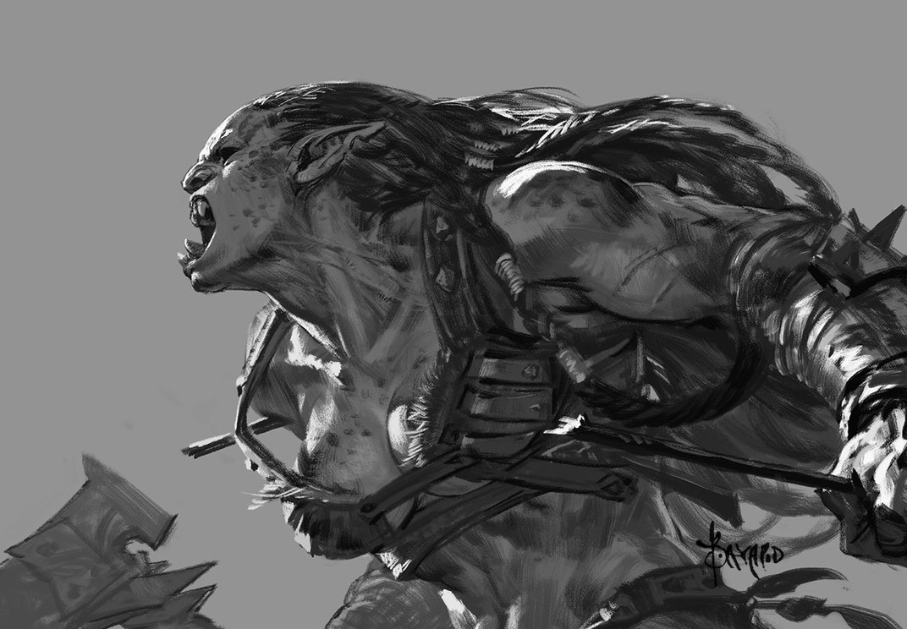
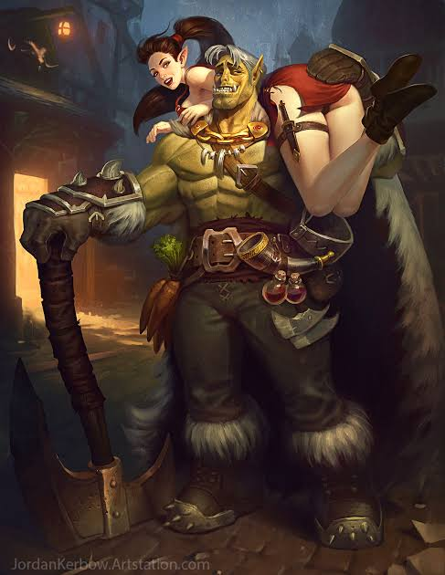

# Orc

The big green bully race.



<figure><figcaption>
Bayard Wu
</figcaption></figure>

<figure><figcaption>
<a href="https://jordankerbow.artstation.com/">Jordan Kerbow</a>
</figcaption></figure>



<table data-header-hidden><thead><tr><th width="165"></th><th></th></tr></thead><tbody><tr><td>Language</td><td>Orc</td></tr><tr><td>Size</td><td>Medium</td></tr><tr><td>Type</td><td>Humanoid</td></tr></tbody></table>



## <mark style="color:green;">Major Features</mark>

<table data-header-hidden><thead><tr><th width="114"></th><th></th></tr></thead><tbody><tr><td>Bully</td><td>+2 bonus to attack with combat maneuvers</td></tr><tr><td>Ferocity [recharge]</td><td>
When you are reduced to zero hit points, you are not defeated until the end of your next turn.  On your next turn you are staggered. If while in ferocity you are healed before your next turn, you are not defeated at the end of your next turn, and this ability is not consumed.

This ability can only activate once per minute.

</td></tr></tbody></table>

## <mark style="color:green;">Minor Features</mark>

<table data-header-hidden><thead><tr><th width="150"></th><th></th></tr></thead><tbody><tr><td>Natural Athlete</td><td>+2 bonus to athletics</td></tr><tr><td>Night Vision</td><td>You treat dim light as bright light.  You treat darkness as dim light.</td></tr></tbody></table>

## <mark style="color:green;">Replace Features</mark>

<table data-header-hidden><thead><tr><th width="151"></th><th></th></tr></thead><tbody><tr><td><strong>Major</strong></td><td> </td></tr><tr><td>Bullying Blow [recharge]</td><td>As a swift action, enhance your next melee attack this turn to deal poise damage equal to its hp damage. This ability cannot be used in consecutive turns.</td></tr><tr><td>Vengeful</td><td>Whenever a creature does damage or poise damage to you, you can mark them as an immediate action. You gain +2 attack against them until you mark someone else.</td></tr><tr><td>Bathe in Blood</td><td>Any turn you take bleed damage (AKA it isn't negated), your slashing weapons gain the bleed property. As a swift action, you lick your blade to take 3 bleed damage.</td></tr><tr><td>Blood Scent</td><td>Your melee attacks gain seeking against wounded creatures</td></tr><tr><td>Porc</td><td>Gain blindsense (scent, 10 ft)</td></tr><tr><td>Savagery</td><td>Get a technique point in the barbarism tree</td></tr><tr><td>Eyes on the Prize</td><td>Your lazy eye allows you to focus on multiple creatures at once. Three creatures need to threaten you in order to flank you.  Certain features that augment flanking, like the beast companion's battle buddy, negate this feature.</td></tr><tr><td>Cataracts</td><td>Your stubbornness against lesser creatures who say "you can't stare at the sun" manifests in your ability to stare directly into the sun and emerge still able to see. You have immunity to the blurred vision and blinded conditions, but suffer -4 perception.</td></tr></tbody></table>

***

| **Minor**         |                                                                                                                                            |
| ----------------- | ------------------------------------------------------------------------------------------------------------------------------------------ |
| Lift              | +100 carry weight                                                                                                                          |
| Gate Crusher      | +2 bonus on athletics to break or move things. You can roll athletics to break an object while charging at a foe as a free action 1/round. |
| Tenacious         | 1/day reroll a fortitude or will save.                                                                                                     |
| Stoic             | You need to be shaken, sickened or clumsy 2 before you suffer any numerical penalties from said conditions.                                |
| Firelord's Chosen | Whenever you deal fire damage, increase the damage by 1.                                                                                   |
| Spooky            | +2 bonus to intimidation                                                                                                                   |

***

## <mark style="color:green;">Lore</mark>

<table data-header-hidden data-full-width="true"><thead><tr><th width="139"></th><th></th></tr></thead><tbody><tr><td>Numbers</td><td>Orcs are usually around 6' and weigh 200 lbs, with a great deal of variance both up and down Orcs are adults by 10 and usually live to be about 50</td></tr><tr><td>Appearance and Biology</td><td>The most telling feature of the orc is the shape of their skull. They have large jaws with an underbite in order to accommodate for their tusks. They also tend to have short pointed ears and either green or gray skin. Some orcs that live in desert regions can get a reddish hue to their skin. Orcs are much larger than most humanoids, typically being taller and having a much higher muscle density. Even the females share this quality. Orcs are very generous with the beatings they give their body, even when it comes to fashion. They get body and face tattoos, piercings all over and they use scars to trace patterns in their flesh. They commonly dress themselves in furs and leathers, or whatever handy material they can harvest from the creatures they hunt: There's no easier way to show off your greatest kill than to wear in on your sleeve. Literally.</td></tr><tr><td>Barbarism</td><td>No two words fit well together quite like orc barbarian. The prototypical barbarian lives only by killing other creatures. Depending on how annoying their neighbors are, this could even mean other humanoids. Individual orcs tend to keep to themselves. It is only when large groups of orcs gather together where they start becoming a problem for anything around them. It isn't uncommon for a charismatic leader to arise among tribes and unify a few hundred (or more). Then, emboldened by their numbers, they try to take over surrounding towns. More often than not, these types of battles happen between orcs and other orcs. Orcs will have long and drawn out histories of their clan and the surrounding ones, with shaky alliances and even shakier reasons for breaking them. The call for glory in battle is often answered with an almost religious zeal. It isn't all blood in guts within the walls of orc villages. They take great interest in animals; and not just to eat them! They make excellent beast tamers and in general are talented when it comes to the druidic arts. Even the barbarians have animal spirits they use to guide their bestial fighting styles. Orcs are surprisingly mindful when it comes to maintaining a natural equilibrium in their local ecosystem. Unfortunately, they don't share the same degree of respect for places they consider far from home.</td></tr><tr><td>Friend or Foe?</td><td>Because of their proclivity for violence, orcs are near universally feared and avoided unless necessary. Orc culture can be very intimidating to outsiders who are accustomed to less violence. So their questions become "can I trust an orc?" or  "are orcs dangerous?" This typically depends on the situation. If you hear the war horns, most definitely. But most situations aren’t nearly as cut and dry. Travelling along the road and seeing a half dozen group eyeing your party might make a merchant sweat a little. Much to the dismay of traveling merchants, they will likely end up in many situations with orcs where they are forced to choose between their goods or their life. Orcs are bullies that use the threat of violence as leverage in order to get what they want. Unfortunately for orcs, they are also prone to misdirection. Convince them that there is a much more lucrative option and they might spare you and your goods.</td></tr><tr><td>Outsiders</td><td>Orcs that don't align with a particular tribe tend to be drifters, hopping into whatever group their particular talents and morals are well suited for. Common entries are mercenary groups, organized crime and state militaries. Most people tend to view orcs with the same kind of wariness one affords a natural predator; respect, but stay cautious. This serves them well when they want to rise through the ranks of a military, but does little to aid in friendly relations with others. Rarely does a town have a neighborhood filled primarily with orcs, but they tend to pepper any town with more than a few thousands people. Separated from traditional orc culture, orcs can find great success with studies of magic and the arts just like most other people, but they have a bit of an uphill battle getting past stereotypes,</td></tr></tbody></table>

