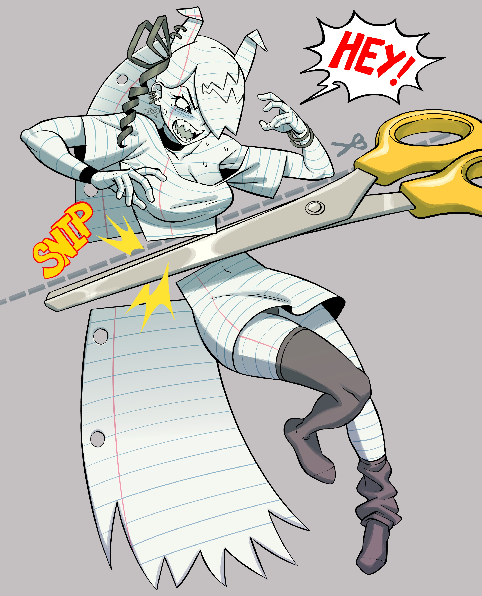

# Poplin

The toy companion race.



<figure><figcaption>
By <a href="https://x.com/joecanvas">Joecanvas</a>
</figcaption></figure>



<table data-header-hidden><thead><tr><th width="131"></th><th></th></tr></thead><tbody><tr><td>Language</td><td>Racial language of bonded sibling</td></tr><tr><td>Size</td><td>Small</td></tr><tr><td>Type</td><td>Humanoid,  Construct</td></tr><tr><td>Miniaturize</td><td>As a standard action, you can shrink drastically to the size of an action figure, only a few inches tall. This decreases your speed to 15 and causes you to deal half damage with any of your attacks, but gives you hide in plain sight among toys. You can grow back to your usual size as a standard action.</td></tr><tr><td>Bonded Sibling</td><td>Poplin are born from the wishes of children as they play with their toys. They never physically grow like their sibling does, but they grow as people in tandem. Poplins die when their bonded sibling die. When their sibling takes damage, they know. They can always tell the direction of their sibling.</td></tr></tbody></table>



## <mark style="color:green;">Major Features</mark>

<table data-header-hidden><thead><tr><th width="142"></th><th></th></tr></thead><tbody><tr><td>Amiibo [companion]</td><td>With 8 hours of work and 100g worth of materials, you can create a toy/plushie etc that mimics the appearance of you or another creature. If you make it out of another creature, that creature must perform a brief ritual requiring one minute of contact to enable its magical effects. This amiibo functions like an old school telephone, capable of sending and receiving calls, but is limited specifically between the amiibo and the creature that it was constructed to resemble. There are modes to the amiibo that make it silent, vibrate or make loud noise in order to indicate contact. Amiibos of bonded siblings do not cost companion slots. It's also no substitute for interacting with them in person.</td></tr></tbody></table>

## <mark style="color:green;">Minor Features</mark>

<table data-header-hidden><thead><tr><th width="121"></th><th></th></tr></thead><tbody><tr><td>Toy Speech</td><td>While in miniature form, you gain the ability to speak to other inanimate toys. This can include things like plushies, action figures, dolls, rubber duckies and anything similar. They are generally only able to communicate things that they have seen or heard recently.</td></tr><tr><td>Mix and Match</td><td>Your ability to exchange limbs, hair and such gives you +2 disguise.</td></tr></tbody></table>

## <mark style="color:green;">Replace Features</mark>

<table data-header-hidden><thead><tr><th width="144"></th><th></th></tr></thead><tbody><tr><td><strong>Major</strong></td><td> </td></tr><tr><td>Magic Wisdom Ball</td><td>You gain an additional use of prayer. If you had none, gain one. The answer is revealed to you through a physical object inside of your body. Other people can use your prayer to ask questions. This functions similarly to a magic conch or magic 8 ball esque item.</td></tr><tr><td>Transformer</td><td>As part of your build you were designed to also be a tool or a more complex toy. Once you choose what form you can take, it cannot be changed without significant physical augmentation. As a standard action you can transform into or back from this alternate form. You function as a masterwork tool for any creature using you, giving them a +2 bonus, or +4 if you are trained in the skill (treated as assisting). You could also transform into other objects such as a pogo stick (increase jump height to movespeed) or a bike (increase speed to 50). While in this form, you can only perform your intended purpose, move or transform back.</td></tr></tbody></table>

***

<table data-header-hidden><thead><tr><th width="151"></th><th></th></tr></thead><tbody><tr><td>Minor</td><td> </td></tr><tr><td>Wind Up</td><td>You have a mechanism that allows you to perform very high jumps by storing kinetic energy. "Winding up" requires 3 standard actions. When wound up, you can boost the next jump action that you take to allow you to jump as high and as far as you can move.</td></tr><tr><td>Bobblehead</td><td>Your head is built to be much better at absorbing shock. Creatures need to roll 11+AC to crit you.</td></tr><tr><td>Collector's Edition</td><td>Your pedigree precedes you, lending you more credence than you deserve. +2 deception</td></tr><tr><td>Kung-Fu Grip</td><td>DR10 vs disarm.</td></tr></tbody></table>

***

## <mark style="color:green;">Lore</mark>

<table data-header-hidden data-full-width="true"><thead><tr><th width="138"></th><th></th></tr></thead><tbody><tr><td>Numbers</td><td>Poplin are around 2'6, and weigh around 30 lbs Polpin do not age. Their life is inherently tied to another, and they live as long as their bonded sibling</td></tr><tr><td>Magic of Life</td><td>As animated toys, poplin cannot reproduce, nor can they be created consistently. Instead there is a mysterious force that animates the toys of children experiencing hardship. Wizards debate the origin, but the transformation is obviously magical in origin, so its probably another powerful anonymous mage. Either way, these creatures come into being with the same mentality as the young children that create them: that of a curious ignorant creature with a generally positive outlook on the world, especially their bonded sibling, whom they immediately feel kinship towards.</td></tr><tr><td>Appearance</td><td>
Poplins often have strange appearances that are facsimiles of humanoid creatures. Common ones are plushies and action figures. As such they often have seems and stitches, very visible joints, shiny, smooth or fluffy surfaces. They are often able to move in unnatural ways, such as turning their limbs all the way around or turning inside out to change their appearance; toys are creative. Usually poplin are afforded a bit more mobility than most other toys and plushies, with bending fingers and flapping lips to allow for fine manipulation and speech.

Poplin generally stay about the same in appearance as they age from when they are magically willed into existence unless they go out of their way to replace parts of themselves. During old age, they start to literally fall apart as their sibling deteriorates. Their colors fade, seams pop and joints creak.
</td></tr><tr><td>Sibling Squabbles</td><td>
The way that poplin view their bonded sibling is just that, as though they were siblings. There generally a great degree closeness between a poplin and their sibling. They often play together, help each other out, fight over who gets the last cookie etc.

Childhood is usually the easy part, as the poplins dependence on their sibling doesn't matter as much for carefree children with a lot of free time. Poplin often find it difficult to get out of the naïve mindset of a child. So once their sibling becomes an adult, they can often become less important. Suddenly all of those sleepovers and woodland adventures are replaced by the reality and responsibility of adulthood. Poplin can find it difficult coming to terms with living apart from their bonded sibling, often being seen as the toys they resemble. Nothing is more crushing than hearing something like "Oh that's just a toy I used to play with as a kid." From their sibling. Those that adjust well settle for frequent family gatherings, settling as coworkers or adventurers. Poplin separated from their sibling, young or old, are incomplete. They are missing an important part of themselves. Parents who take the poplin away or siblings that distance themselves in adulthood put themselves in danger, for there are few fixations stronger than that of a disgruntled poplin separated from their sibling. Poplin separated from their bonded siblings invariably become menaces to the people or society they see as the cause of their torment.
</td></tr></tbody></table>

