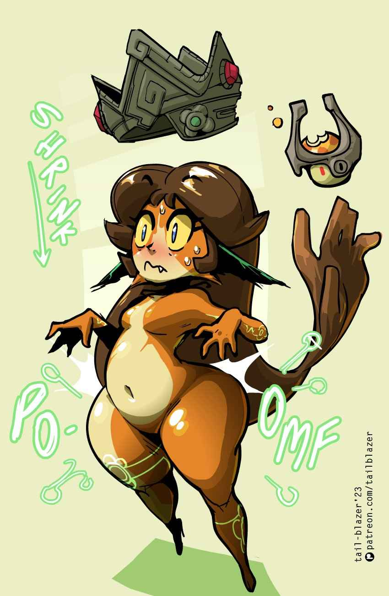

# Shades

The definitely not Midna race.



<figure><figcaption>
<a href="https://www.deviantart.com/maniacpaint/art/MidnA-12-353724398">Maniac Paint</a>
</figcaption></figure>

<figure><figcaption>
Tail Blazer
</figcaption></figure>



<table data-header-hidden><thead><tr><th width="128"></th><th></th></tr></thead><tbody><tr><td>Language</td><td>Necril</td></tr><tr><td>Size</td><td>Small</td></tr><tr><td>Type</td><td>Humanoid</td></tr></tbody></table>



## <mark style="color:green;">Major Features</mark>

<table data-header-hidden><thead><tr><th width="164"></th><th></th></tr></thead><tbody><tr><td>Darkvision</td><td>You can see in the dark as well as you could in light, albeit in grayscale.</td></tr><tr><td>Hairy [concentration]</td><td>You have an additional hand that forms from your hair that can be used to hold objects, but not wield or activate them. You can also use this limb to perform combat maneuvers such as grapple. If you concentrate (free action), you can extend the reach of this hand to 10 ft, or 20 ft when in dim light or darkness. This single limb is more than enough to hold your own body weight and lift you to high places. If your hair is ever cut, it grows back within a week.</td></tr></tbody></table>

## <mark style="color:green;">Minor Features</mark>

<table data-header-hidden><thead><tr><th width="145"></th><th></th></tr></thead><tbody><tr><td>Pattern Recognition?</td><td>Your skin consists of 2 primary colors, and you can shift them around to create varying patterns. +2 Disguise</td></tr><tr><td>Magic Tattoos (Su)</td><td>You can inscribe faintly glowing lines along surfaces by tracing with your fingers in a specific color, chosen at character creation. You can automatically remove the lines Dispel magic automatically gets rid of all writing. Some scrubbing also gets the job done. If you draw on your own skin, only you can remove them.</td></tr></tbody></table>

## <mark style="color:green;">Replace Features</mark>

<table data-header-hidden><thead><tr><th width="157"></th><th></th></tr></thead><tbody><tr><td><strong>Major</strong></td><td> </td></tr><tr><td>Shadow Realm (Su) [teleportation]</td><td>After channeling for 1 minute without taking damage, you can open up a 10x10 ft portal to your own pocket dimension for 1 round. The shadow realm is a black mostly featureless void with a tangible floor, but not much else. You can bring in any number of creatures, or any amount of objects so long as it can be brought in within 1 round. This dimension can only exist as long as you are inside of it and alive. If you leave, are banished or die, the contents of the dimension are immediately ejected to the same point you entered from.</td></tr><tr><td>Shadow Friend (Su) [recharge] [scrying]</td><td>You can animate your shadow and have it walk around. You can see and hear through your shadow. Your shadow can move anywhere as long as there is a continuous stream of dim light or darkness connecting you and your shadow. As a shadow, you must move along a continuous surface at all times. If 2 surfaces are not connected, you cannot move between them. You can easily move along walls or ceilings however. While animating your shadow, a tether connects you that is significantly darker than even complete darkness, visible to creatures with night vision or darkvision. If the shadow or the tether is attacked, or if the shadow/tether is exposed to bright light, shadow friend immediately ends.</td></tr><tr><td>Shade Magic (Su)</td><td>You have a hover speed of 30 ft.</td></tr><tr><td>Insubstantial (Su) [mana burn]</td><td>As a FRA, you can [mana burn] 1 in order to pass through a surface no thicker than 1 ft. Once you appear, you are dazed for 1 round. By placing your hand on a wall, you can tell when you can and cannot use this ability.</td></tr></tbody></table>

***

<table data-header-hidden><thead><tr><th width="152"></th><th></th></tr></thead><tbody><tr><td><strong>Minor</strong></td><td> </td></tr><tr><td>Underfoot</td><td>+2 stealth</td></tr></tbody></table>

***

## <mark style="color:green;">Lore</mark>

<table data-header-hidden data-full-width="true"><thead><tr><th width="141"></th><th></th></tr></thead><tbody><tr><td>Numbers</td><td>Shades tend to be 3'6 tall and weigh 40 lbs They reach adulthood by 12 and live to be about 60</td></tr><tr><td>Appearance and Biology</td><td>Shades are short in stature with mostly smooth skin that is a mixture of a dull dark color, usually black, and some other low saturation brighter color, usually blue. These two colors can form unique patterns on the skin, much like how animal fur patterns exist. Their eyes and hair tend to be more vibrant colors, contrasting their dull skin. They grow hair on their heads much faster than other races, forcing them to get frequent haircuts. Thanks to their magical abilities, their hair can appear even longer than it is. They also inscribe tattoos on their skin for added customization. Shades possess the usual sex organs present in most humanoids, but their innate magical abilities gives them the ability to hide most features on their skin to give themselves "barbie bod," making their body smooth and featureless. As such, some opt to not even wear clothing. Most do wear clothing, and they prefer things that show off their skin and are frilly like dresses and veils.</td></tr><tr><td>Shadow Cursed</td><td>
There exists a land in Nick Nacks considered uninhabitable by most known as the Shadow-Cursed lands. These islands are plagued with eternal darkness as a result of a curse placed upon them by the vampiric overlords that desired more suitable living conditions. As such, all kinds of undead spawn inside of this area. The souls of heroes that tried to cleanse this land serve as ammunition for all of the necromantic research that happens within.

Many years ago, an enclave of goblins was forced to flee by sea and was chased to one of these shadow-cursed islands. The goblins thought they had lost their pursuers, but the adventurers were merely unwilling to follow, having heard the rumors of the treacherous environments that often lie within. The adventurers claimed their gold for a job well done, and the goblins were forgotten. Snap back to the present day where the shadow-cursed islands have become a much greater focus of adventuring parties and that same island was explored. Much to their surprise, the adventurers found creatures settling in these lands that weren't interested in stealing their souls. More and more sightings of this magical small race with strange dexterous hair were noted all around the world. As scholars began compiling data about these Shades as they called themselves, they were able to trace their history back to that group of goblins all those years ago. Shades have since become the envoys between the shadow-cursed isles and the rest of the world, working as guides and teachers.
</td></tr><tr><td>Twilight Princess</td><td>Aside from the physical changes the goblins experienced, they also went through many cultural shifts. They learned a new language that they used to read records etched into the abandoned stony ruins they initially called home and to communicate with the locals. Through this learning, one of their leaders was able to befriend a local witch, and received some magical boons in return. Over time the relationship between the goblins and this witch deepened. The goblins would happily attend to her needs, acquiring rare materials, scouting out new islands to set up bases and dispatching pests. Soon enough she was referred to as the twilight princess and highly revered by all. After many generations of goblins living in the shadow cursed lands and receiving these magical boons, they stopped being goblins after a certain point. Their skin and hair had completely changed colors to more closely resemble their princess. Their relationship with the twilight princess deepened their magical capabilities. The more treacherous environment and dependence on the princess had changed their culture. One day without warning, the twilight princess disappeared, leaving behind only an infant that closely resembled her and a letter to her people, who she referred to as her little shades. The name stuck and since then, the twilight princess has been treated as royalty. She continues to guide the shades through life in the shadow cursed lands. </td></tr></tbody></table>

